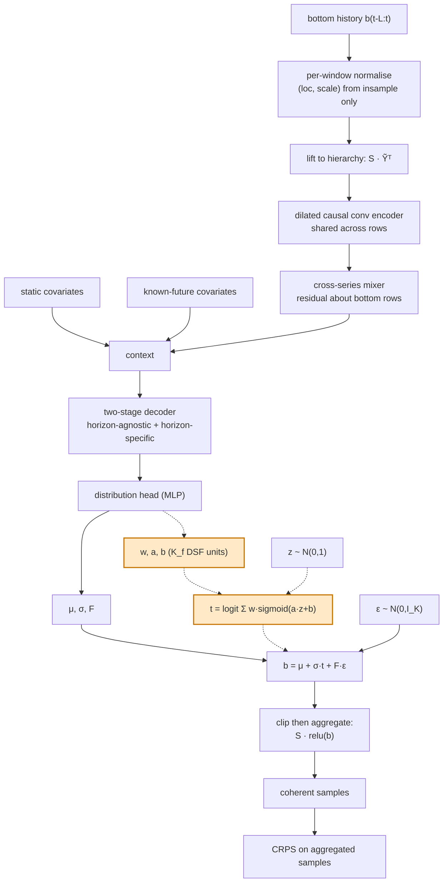

# Repository analysis for the learned-marginal paper

Written for the project's own authors. Everything here was read off this repository at
commit `07b7032` (branch `normalized-flow`). Numbers are quoted from result files, not
recomputed by hand except where a command is given. Anything the repository does not
settle is marked **[NEEDS VERIFICATION]** or **[EXPERIMENT REQUIRED]**.

The paper draft built on this analysis is [paper.tex](paper.tex), with
[references.bib](references.bib).

---

## 1. What the code actually does

### 1.1 Forward pass, traced

```
bottom history  Y = b_{t-L:t}                    [B, L, Nb]   raw units
  │  window_stats(insample, scaler)              -> (loc, scale) from insample ONLY
  │  normalize                                    model/normalization.py
  ▼
Ỹ                                                [B, L, Nb]
  │  einsum("ij,bjl->bil", S, Ỹᵀ)                 lift to every hierarchy row
  ▼
Ỹ_hier                                           [B, Na+Nb, L]
  │  DilatedConvEncoder  (shared weights, left-padded, causal, last step)
  ▼
H_enc                                            [B, Na+Nb, C]
  │  CrossSeriesMixer:  H_enc[-Nb:] + MLP(vec(H_enc))
  ▼
h_hist                                           [B, Nb, C]
  │  concat  MLP_stat(stat_exog), MLP_futr(futr_exog)
  ▼
context                                          [B, Nb, context_dim]
  │  TwoStageDecoder: [horizon-specific ; horizon-agnostic ; raw future covars]
  ▼
z                                                [B, Nb, H, D]
  │  HEAD = MLPBlock(D -> n_out)                 ← THE ONLY THING WE CHANGE
  ▼
FactorParams / FlowParams / CopulaSplineParams / ...
  │  denormalize_params(params, scale)           exact affine inverse
  │  sample_coherent -> sampler by params type
  ▼
bottom draws                                     [B, H, Nb, N]
  │  coherent_aggregate: einsum("ij,...jn->...in", S, relu(bottom))
  ▼
hierarchy draws                                  [B, H, Na+Nb, N]
  │  crps(aggregate_targets(S, target), samples, reduction="none")
  ▼
loss  (÷ batch target mass when normalize_loss)
```

Source: [model/network.py](../../model/network.py),
[model/distribution.py](../../model/distribution.py),
[training/trainer.py](../../training/trainer.py),
[pipeline/runner.py](../../pipeline/runner.py).

### 1.2 The "MLP5" equivalent

There is no module named MLP5. The final distribution parameterisation is
`MLPBlock(in_dim, n_out)` inside each head class — `Linear → ReLU → Linear` with one
hidden layer of width `n_out` by default ([model/blocks.py](../../model/blocks.py)).
`n_out` per head:

| head | `n_out` | contents |
|---|---|---|
| `factor_model` | `2 + K` | μ, σ̃, K loadings |
| `normalizing_flow` | `2 + 3·K_f + K` | μ, σ̃, w̃(K_f), ã(K_f), b(K_f), K loadings |
| `normalizing_flow_shared` | `2 + K` | μ, σ̃, loadings; (w,a,b) are global `nn.Parameter`s |
| `copula_spline` | `2 + 2·n_bins + (n_bins−1) + K` | μ, σ̃, widths, heights, interior derivatives, loadings |
| `copula_flow` | spline + flow + `2 + K` | both transform families composed |
| `skew_t` | `4 + K` | μ, σ̃, ν̃, λ, loadings |
| `gmm` | `3·n_comp + K` | per-component μ, σ̃, logits, shared loadings |

### 1.3 Answers to the specific questions asked

| # | question | answer, as implemented |
|---|---|---|
| 1 | base distribution | standard normal `z ~ N(0,1)`, iid per (series, horizon, draw) |
| 2 | conditioning information | the decoder output `z_{i,τ}` — history, static + future covariates, hierarchy position — via the head MLP. Parameters are **amortised**, not passed as a flow input |
| 4 | what the flow transforms | only the **idiosyncratic** innovation `z`, *not* the factor term |
| 5 | transformation family | deep sigmoidal flow ([Huang et al. 2018](https://proceedings.mlr.press/v80/huang18d.html)); RQ spline ([Durkan et al. 2019](https://papers.nips.cc/paper/2019/hash/7ac71d433f282034e088473244df8c02-Abstract.html)) for the copula heads |
| 6 | number of flow layers | **one** DSF layer with `K_f` sigmoid units (default 8). Not a stack. `copula_flow` is the only 2-layer head (spline ∘ DSF) |
| 7 | how parameters are produced | `w = softmax(w̃)`, `a = softplus(ã) + a_floor` (0.1), `b` raw — `model/heads.py::_flow_shape` |
| 8 | flow type | neither autoregressive nor coupling: a **scalar elementwise monotone** flow. No dimension mixing inside the flow |
| 9 | conditional? | yes, in the amortised sense |
| 10 | transformed dimensions | scalar per (batch, horizon, series, draw); shape params `[B,H,Nb,K_f]` |
| 11 | numerical stability | `softmax` on weights, `softplus + 0.1` slope floor, sigmoid sum clamped to `[1e-6, 1-1e-6]` before the logit; spline gets identity tails outside ±4 and boundary derivatives pinned to 1 |
| 12 | sampling | `t = dsf(z)`, then `μ + σ·t + F·ε`, reparameterised so gradients reach every flow parameter |
| 13 | log probability | **never computed.** No inverse, no log-determinant. Only the forward direction exists. Confirmed by reading `_dsf_transform` and grepping the repo — there is no `log_det`/`log_prob` anywhere |
| 14 | relation to CRPS | the objective *is* CRPS on aggregated samples (U-statistic estimator). The flow is a differentiable simulator; no likelihood term |
| 15 | integration | one registry entry + one sampler branch. `denormalize_params` passes flow params through unchanged (they are scale-free) |
| 16 | per-series or joint | **per series** — one independent scalar flow per (series, horizon). No joint/multivariate flow |
| 17 | cross-series dependence | unchanged from the baseline: `Cov = diag(σ²) + FFᵀ`, the shared `ε` being what couples series |
| 18 | coherence | unchanged and exact: `S·relu(bottom)` per draw, applied identically for every head. Coherence is **invariant to the head** |

### 1.4 Three structural facts we verified numerically

Run these to reproduce (the transcript is in the session that produced this document):

1. **At initialisation the flow head *is* the Gaussian baseline.** With
   `w̃ = ã = b = 0` and `a_floor = 0.1`, all units coincide, so
   `dsf(z) = (softplus(0) + 0.1)·z = 0.7931·z` exactly (max error 7·10⁻⁷ over
   z ∈ [−3,3]). The flow head therefore starts as Gaussian with σ rescaled by 0.7931
   and can only deviate by learning. Good for comparison fairness.
2. **The Gaussian is a point of the family, not a limit.** Whenever all `K_f` units
   share `(a, b)`, `dsf(z) = a·z + b` exactly (verified at three `(a,b)` pairs to
   ≤7·10⁻⁵).
3. **μ and σ lose their meaning once the flow is non-affine.** For a random φ we
   measured `E[t] = −0.110`, `sd[t] = 0.531` — so μ is not the mean and σ is not the
   sd. The parameterisation is redundant. Harmless for CRPS, but do not describe μ as
   a mean in the paper.

### 1.5 The structural limitation that drives the whole result

`sample_flow_factor_model` computes `μ + σ·dsf(z) + F·ε`. The factor term is
**still Gaussian and additive**, and independent of `z`. So the realised bottom-level
marginal is a *convolution* of the warped law with `N(0, ‖F_i‖²)`. Gaussian smoothing
shrinks every standardised cumulant of order ≥3, so the flow's non-Gaussianity is
partially undone, and more so the larger the factor term's variance share

```
ρ_i = ‖F_i‖² / (σ_i²·Var[dsf(z)] + ‖F_i‖²)
```

`copula_spline` has no such term — it warps `(z + Fε)/√(1+‖F‖²)` as a whole, so the
marginal is exactly the warped law and rank correlation is preserved exactly. **This
placement difference is the paper's strongest technical content.** ρ was never
measured — see §6.

---

## 2. Original CLOVER vs our method

| | original CLOVER (`factor_model`) | our method (`normalizing_flow`) |
|---|---|---|
| encoder / mixer / decoder | dilated causal conv / residual cross-series MLP / two-stage | **identical** |
| head output width | `2 + K` | `2 + 3·K_f + K` |
| innovation | `z ~ N(0,1)` | `dsf(z; w,a,b)`, monotone, learned per (series, horizon) |
| factor term | `F·ε`, Gaussian | **identical, Gaussian** |
| bottom marginal | exactly Gaussian | warped-Gaussian ⊛ Gaussian |
| cross-series dependence | `diag(σ²) + FFᵀ` | **identical** |
| coherence | `S·relu(b)` per draw | **identical** |
| objective | CRPS on aggregated samples | **identical** |
| denormalisation | affine on μ,σ,F | **identical** (flow params scale-free) |
| likelihood available | no (sample-based) | no |

The secondary variant (`copula_spline`) changes one more thing: the transform is
applied to the whole correlated draw, and the standalone `σ·z` term disappears.

---

## 3. Verified experimental results

### 3.1 Which files are the final experiment

| file | seeds | what it is | use it? |
|---|---|---|---|
| `bench_flow_vs_gaussian.jsonl` + `.json` | 12 | flow vs Gaussian, 6 datasets + police baseline (5) | **yes — primary** |
| `bench_spline_vs_gaussian.jsonl` + `.json` + `.log` | 12 | copula_spline vs Gaussian, 7 datasets | **yes — primary** |
| `bench_flow_capacity.json` | 5 | `K_f ∈ {4,16,24}` | yes, as ablation, with caveat |
| `bench_5seed.json` | 5 | Gaussian / flow / flow_shared | reference only (superseded) |
| `bench_copula_flow.json`, `bench_copula_spline.json` | 5 | overall only | reference only |
| `bench_tails.json` | 5 | pinball at q=0.01/0.5/0.99 | reference only |
| `bench_results.json`, `bench_results2.json` | 1 | single-seed early runs | **do not use** |
| `results/*_scrps.csv`, `results/*_seed*.json` | 1–20 | single CLI runs, incl. `labour_ec_*` (the VECM branch) | **do not use for this paper** |
| `results/figures/traffic_multiseed/*.jsonl` | 20 | traffic only, 3 heads, with draws | use for the qualitative figure |

Only `bench_flow_vs_gaussian.py` is committed. **The scripts that produced
`bench_flow_capacity.json`, `bench_tails.json`, `bench_5seed.json` and the two
copula files are not in the repository** — no committed code emits head labels `n4`/
`n16` or pinball metrics. Those files cannot be regenerated as the repo stands.

### 3.2 Headline numbers

Overall sCRPS, 12 matched seeds, paired Wilcoxon vs `factor_model`
(full table in [paper.tex](paper.tex) Table 2):

| dataset | Gaussian | flow | Δ% | wins | p | spline | Δ% | wins | p |
|---|---|---|---|---|---|---|---|---|---|
| labour | 0.008091 | 0.007946 | **−1.78** | 9/12 | **0.034** | 0.008004 | −1.07 | 6/12 | 0.519 |
| prison | 0.046746 | 0.043348 | **−7.27** | 10/12 | **0.027** | 0.047597 | +1.82 | 6/12 | 0.910 |
| tourism_small | 0.069716 | 0.065086 | **−6.64** | 11/12 | **0.002** | 0.069194 | −0.75 | 6/12 | 0.733 |
| wiki2 | 0.246856 | 0.245650 | −0.49 | 5/12 | 0.791 | 0.239581 | **−2.95** | 10/12 | **0.012** |
| traffic | 0.020019 | 0.021204 | +5.92 | 4/12 | 0.233 | 0.020955 | +4.68 | 4/12 | 0.266 |
| tourism_large | 0.128782 | 0.125960 | −2.19 | 10/12 | 0.052 | 0.124995 | **−2.94** | 10/12 | **0.005** |
| police | 0.347436 (5) | — | — | — | — | 0.349248 | +1.29† | 1/5 | 0.125 |

† paired on the 5 common seeds; the unpaired 12-vs-5 comparison gives +0.52%.

Under a Holm correction across the 13 tests, only tourism_small/flow and
tourism_large/spline survive at 5%.

**Key qualitative finding:** the flow and the spline win on *disjoint* datasets. They
differ only in where the learned marginal is applied → placement matters more than the
transform family.

### 3.3 Per-level

Full table in paper.tex Table 3. The pattern worth writing about: on prison the flow's
gain is concentrated at *aggregate* levels (Total −29.3%, Gender −28.3%) while the
bottom level is 2.5% *worse*; on traffic the loss is at the top (Total +20.7%,
Halves +21.9%) while the bottom level is flat (−0.5%). A marginal-only change
propagates upward through `S·relu(b)`, so aggregate levels are where it shows.

### 3.4 Non-Gaussianity diagnostics — new, added by this analysis

The repository had **no** normality test, skewness, kurtosis, QQ plot or distribution
diagnostic of any kind (`grep -i "shapiro|kurtosis|skewness|normaltest|jarque|probplot"`
returns nothing). Added [`scripts/marginal_diagnostics.py`](../../scripts/marginal_diagnostics.py),
which writes `results/marginal_diagnostics.csv` and `..._summary.csv`.

Method: seasonal-naive residual `e_t = y_t − y_{t−m}` at the period implied by the
dated index, standardised by its own sd; D'Agostino–Pearson omnibus test; BH FDR
control at 5% across series. **It is a proxy** for CLOVER's conditional residual, not
the thing itself — say so in the paper.

Bottom-level series:

| dataset | n resid | median skew | share skew>0 | median excess kurt | reject rate | median zero share |
|---|---|---|---|---|---|---|
| tourism_small | 32 | −0.055 | 0.446 | 0.507 | 0.107 | 0.000 |
| prison | 44 | +0.258 | 0.719 | −0.046 | 0.312 | 0.000 |
| labour | 491 | −0.021 | 0.438 | 0.578 | 0.469 | 0.000 |
| police | 327 | +0.000 | 0.492 | 2.423 | 0.916 | 0.790 |
| tourism_large | 216 | −0.007 | 0.493 | 6.848 | 0.957 | 0.031 |
| traffic | 260 | −0.187 | 0.410 | 8.528 | 1.000 | 0.000 |
| wiki2 | 359 | +0.200 | 0.707 | 49.874 | 1.000 | 0.000 |

Three conclusions, two of them negative:

1. **The Gaussian marginal is a poor description of most of these series** — but
   through *tail weight*, not skew. Median |skew| ≤ 0.26 everywhere; median excess
   kurtosis reaches 49.9.
2. **The "tourism is right-skewed" premise is not supported.** Median residual skew is
   −0.055 (tourism_small) and −0.007 (tourism_large), ~half the series either side.
   The datasets with detectable positive skew are **prison** (+0.258, 71.9% positive)
   and **wiki2** (+0.200, 70.7% positive). Re-attach any skew motivation to those two.
3. **Non-Gaussianity predicts the flow's benefit with the wrong sign.**
   Spearman(median excess kurtosis, flow Δ%) = **+0.886, p = 0.019, n = 6**;
   Spearman(reject rate, flow Δ%) = +0.870, p = 0.024. Δ% < 0 means the flow wins, so
   a positive ρ means **the flow helps least where the Gaussian assumption is most
   violated.** For the spline head, ρ = −0.357 (p = 0.432, n = 7) — the hypothesised
   direction, indistinguishable from noise.

   Confounds that n = 7 cannot separate: rejection rate is partly a *power* artefact
   (tourism_small has 32 residuals per series); series length correlates with Δ%
   (ρ = +0.714, p = 0.111); and so does hierarchy size (ρ = +0.464 for N_b) — the flow
   wins on small hierarchies (N_b = 32, 56) and loses on large ones (N_b = 200).
   A pure parameter-count explanation fits the data equally well.

### 3.5 Capacity ablation (the only ablation that exists)

5 seeds, overall sCRPS. `K_f = 8` is the default, taken from a *different* file.

| dataset | K=4 | K=8 | K=16 | Gaussian |
|---|---|---|---|---|
| labour | 0.008074 | 0.007982 | **0.007900** | 0.008136 |
| prison | 0.044436 | 0.043868 | **0.043539** | 0.045451 |
| tourism_small | **0.063501** | 0.063942 | 0.069399 | 0.066318 |
| wiki2 | 0.252971 | 0.252662 | **0.247347** | 0.246369 |
| traffic | 0.019927 | **0.019307** | 0.021469 | 0.021509 |
| tourism_large | 0.126927 | **0.125795** | 0.126041 | 0.128498 |
| police | **0.347071** | 0.347883 | 0.347902 | 0.347029 |

wiki2 at K=24: 0.252031. Optimum is dataset-dependent and **non-monotone**; at K=16
tourism_small is *worse than Gaussian*. Supports the estimation-variance reading.

Ablations that do **not** exist: flow depth (only one DSF layer is implemented),
hidden dimension of the flow (there is none — parameters come straight from the head
MLP), spline bin count, conditioning strategy, matched-capacity Gaussian control.

---

## 4. Fairness audit

Verified **identical** between heads: dataset, split, horizon, input window, feature
builders, architecture widths, optimiser (Adam), learning rate, LR schedule, batch
size, early-stopping rule and patience, MC sample counts, scaler, objective,
evaluation estimator, quantile grid, and seeds 0–11. The comparison is generated by a
single `model.head=` override on one config file
([scripts/bench_flow_vs_gaussian.py](../../scripts/bench_flow_vs_gaussian.py) `_one()`),
so this is fair by construction.

Differences that remain:
- **No per-head tuning.** Widths/LR were set for the Gaussian head and reused. Fair
  for isolating the head; possibly unfavourable to the candidates.
- **Unequal seeds on police** (5 vs 12).
- **Cross-file ablation.** `K_f = 8` in the capacity table comes from `bench_5seed.json`,
  not from the capacity sweep.

---

## 5. Threats to validity

1. **The test set is a single forecast origin in every dataset** (`n_test = 1`
   everywhere; `pipeline/runner.py::forecast` scores `batcher.batch([0])` only). Seed
   replication varies the *model*, never the evaluation window. This is the biggest
   threat to every number in the paper.
2. **Runs are not bit-reproducible across invocations.** Of the 65 (dataset, head,
   seed) cells present in both `bench_5seed.json` and `bench_flow_vs_gaussian.jsonl`,
   **zero** are identical; 27 differ by >1% relative, 8 by >5%, the worst being
   traffic/Gaussian/seed 3 at 0.024311 vs 0.016233 (33%). Nothing between the two
   commits changes the `factor_model` code path, so this is run-to-run
   nondeterminism, not a version effect. Likely cause: nondeterministic float
   reduction order under differing `torch.set_num_threads`, amplified by early
   stopping picking a different step and by the single-window test set
   **[NEEDS VERIFICATION]**. The paired comparisons stay internally valid (both heads
   ran in the same invocation), but no single cell is exactly reproducible.
3. **Conflicting results on traffic.** The 5-seed file says flow *beats* Gaussian by
   10.2%; the 12-seed file says it *loses* by 5.9% (and by 7.1% on the same first five
   seeds). Report the 12-seed number and flag the conflict. Given (2), traffic is
   genuinely unresolved.
4. **Orphaned result files** (§3.1) cannot be regenerated.
5. **No calibration evidence.** `scripts/forecast_viz.py` hard-refuses any head but
   `factor_model` (`raise SystemExit` if `config.model.head != "factor_model"`), so
   every calibration/PIT figure on disk is Gaussian-only. **Make no calibration
   claim.**
6. **No coherence measurement.** Exact by construction, never measured numerically.
7. **No cross-series-dependence evaluation.** All metrics are univariate CRPS summed
   over series. The energy score is implemented (`training/losses.py`) but no
   experiment used it. **Make no dependence claim**, even for the copula head.
8. **Multiplicity.** 13 paired tests, no family-wise correction in the raw numbers.
9. **The diagnostic in §3.4 is a proxy**, not CLOVER's own residual.

---

## 6. Experiments to run before publication

Ordered by how much they change what can be claimed.

1. **Rolling-origin evaluation** — several test origins per dataset, variability over
   origins reported separately from variability over seeds. Nothing generalises
   without this.
2. **Complete police** — 12 flow seeds, plus Gaussian seeds 5–11.
3. **Measure ρ_i** (§1.5) on trained models. Directly tests the convolution
   explanation for the negative motivation finding. Cheap: one forward pass per
   trained model.
4. **Calibration + PIT for every head** — lift the `factor_model` restriction in
   `forecast_viz.py`. Required before any calibration sentence.
5. **Energy score runs** — tests whether the copula head's rank-correlation guarantee
   buys anything measurable.
6. **Validation-selected K_f**, then rerun the main table.
7. **Matched-capacity Gaussian control** — widen the Gaussian head MLP by the flow's
   parameter count, to separate "learned marginal" from "more parameters".
8. **Determinism** — pin threads, enable deterministic kernels, re-verify seed
   reproducibility, re-run traffic.
9. **Regenerate the orphaned files** from committed scripts, or drop them.
10. **Skew-t and GMM at 12 seeds** — compare against other non-Gaussian families, not
    only Gaussian.

---

## 7. Novelty assessment

Searched: "normalizing flows hierarchical time series forecasting", "conditional
normalizing flow hierarchical forecasting", "non-Gaussian hierarchical forecasting".

Prior art that already combines flows with hierarchical forecasting:
- **NeuralReconciler**, WSDM 2024 (Wang, Sun, Shi, Zhu, Ma, Zhang, Zheng, Liu) —
  attention-based trainable reconciliation + normalizing flow, explicitly motivated by
  non-Gaussian hierarchical distributions. `10.1145/3616855.3635806`
- **arXiv 2212.13706** — autoregressive transformer + conditional-normalizing-flow
  reconciliation. Authors **[NEEDS VERIFICATION]**
- **FRT**, KDD 2025 — flow-based reconcile transformer. Authors **[NEEDS VERIFICATION]**

Prior art for the copula head specifically:
- **Salinas et al., NeurIPS 2019** — low-rank Gaussian copula process with learned
  marginals. This is essentially the `copula_spline` construction, differing mainly in
  using an empirical rather than a learned parametric marginal transform.

**Classification: an integration/ablation contribution, with a negative result about
the motivating premise.** Do **not** claim first-to-apply. The defensible novelty is:
(a) the controlled head-only substitution inside a *coherence-by-construction* model,
where no reconciliation step exists — all three prior systems put the flow in or
around reconciliation; (b) the placement distinction (idiosyncratic vs whole
correlated draw) with evidence it dominates the transform-family choice; (c) the
measurement showing measured non-Gaussianity anti-predicts the benefit.

---

## 8. Figure plan

| # | figure | x | y | models / data | purpose |
|---|---|---|---|---|---|
| 1 | CLOVER architecture + our modification | — | — | — | Mark "original" vs "ours"; one box (the head) and one arrow (`dsf(z)`) highlighted. Mermaid version below |
| 2 | The two placements, side by side | — | — | — | `μ+σ·dsf(z)+Fε` vs `μ+σ·R((z+Fε)/ϱ)`; show the Gaussian factor term surviving in the first |
| 3 | Learned vs Gaussian innovation density | innovation value | density | sampled `dsf(z)` from a trained model, per dataset | Show *what shape was learned*. **[EXPERIMENT REQUIRED]** — needs a trained-model dump |
| 4 | Convolution damping | ρ (Eq. 12) | excess kurtosis of the realised marginal | simulation + trained ρ values | The mechanism. **[EXPERIMENT REQUIRED]** |
| 5 | Δ sCRPS per dataset | dataset | Δ% vs Gaussian | flow, spline | Main result; add per-seed dots to show overlap |
| 6 | Δ sCRPS per level | level (bottom→top) | Δ% | flow | Aggregates gain/lose more than the bottom |
| 7 | Non-Gaussianity vs benefit | median excess kurtosis (log) | flow Δ% | 6 datasets | The negative finding; label points, show ρ and p, annotate the length confound |
| 8 | Capacity ablation | K_f ∈ {4,8,16} | overall sCRPS | 7 datasets, Gaussian as dashed line | Non-monotone, dataset-dependent |
| 9 | Seed-averaged fan charts | date | value | traffic, 3 heads | Already on disk: `results/figures/traffic_multiseed/fan_charts_test_*.png` |
| 10 | Calibration per head | nominal coverage | empirical coverage | all heads | **[EXPERIMENT REQUIRED]** — plotting path is Gaussian-only |

Figures 5–8 can be produced from files already on disk. Figures 3, 4, 10 cannot.

### Mermaid architecture sketch



Dotted edges and shaded nodes are our modification; everything else is original
CLOVER. Note that `Z → WARP` replaces a direct `Z → SAMP` edge in the baseline.

---

## 9. Potential weaknesses a reviewer will attack

1. "Your test set is one window." — Fatal unless §6.1 is done.
2. "The flow adds parameters; is this a capacity effect?" — Needs §6.7.
3. "Your motivation is contradicted by your own diagnostic." — True; we say so. Make
   sure the framing is "we tested the premise and it failed" rather than burying it.
4. "n = 6 datasets for a correlation claim." — Report ρ with the confounds, do not lead
   with it.
5. "Flows for hierarchical forecasting already exist." — Addressed by the positioning
   in §7; do not overclaim.
6. "You call it a learned marginal but a Gaussian is convolved back in." — True for the
   primary head; §1.5 is the honest treatment and turns the objection into a finding.
7. "No calibration, no coherence, no dependence metric." — Acknowledged in Limitations.
8. "The result is not reproducible." — §5.2. Disclose it; do not let a reviewer find it.
